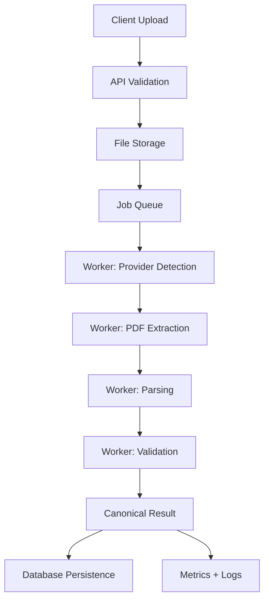

# Enterprise Processing Blueprint

## Objective

This document captures the enterprise-level processing architecture for the CAS parser. It complements the current technical foundation by describing how the service should evolve for production-grade reliability, scale, compliance, and observability.

---

## Core production goals

- accept PDF uploads at scale
- support encrypted PDFs with secure password handling
- parse multiple provider layouts consistently
- validate outputs before returning results
- provide traceable, auditable job history
- enable asynchronous processing and retries
- monitor latency, quality, and failures

---

## Processing lifecycle

---

## Enterprise components

### 1. API layer

The FastAPI application remains the public entry point. It should accept:

- uploaded PDF file
- optional document password
- metadata such as tenant, job type, callback target, and source channel

The API should respond quickly with a parse ID and job status instead of blocking on long-running parsing.

### 2. Queue and worker layer

Use an async task queue such as:

- Celery + Redis
- RabbitMQ + worker processes
- Temporal for workflow orchestration

This prevents the request thread from doing heavy extraction work and allows retries and backpressure handling.

### 3. Storage layer

Use:

- PostgreSQL for job metadata and canonical results
- MinIO or S3 for original and processed PDFs
- blob storage for OCR output and intermediate artifacts

### 4. Extraction layer

The extraction layer should support:

- standard text extraction
- OCR fallback for scanned documents
- password-aware document opening
- quality scoring before accepting extracted text
- multiple parallel extraction strategies for validation

### 5. Parsing layer

The parser layer should be provider-specific but normalized to a common result contract. Real document fixtures should drive parser logic. Each provider implementation should return:

- normalized statements
- folio entries
- transactions
- valuations
- warnings and quality notes

### 6. Validation and confidence engine

Each result should be validated before being marked as complete. Validation checks should include:

- required fields presence
- date sanity checks
- numeric reconciliation
- duplicate detection
- scheme/folio consistency
- confidence threshold enforcement

### 7. Monitoring and observability

The platform should emit structured logs and metrics for:

- request latency
- queue length
- failure rate
- OCR fallback usage
- provider classification confidence
- parse success rate by provider
- validation rejection rate

---

## Security requirements

- restrict file upload size
- verify file signature and extension
- support encrypted PDFs only with explicit password input
- redact or avoid logging sensitive financial values
- isolate tenant data and access boundaries
- secure credentials and storage keys in environment-based secret management

---

## Operational policies

- failed parse jobs should be retried with bounded retry budgets
- low-confidence outputs should be routed for review or reprocessing
- invalid or unsupported documents should be recorded with a clear failure code
- only approved document layouts should be treated as production-ready

---

## Enterprise deployment topology

Recommended deployment topology:

- API service behind load balancer
- worker pool for parsing jobs
- Redis or RabbitMQ broker
- PostgreSQL primary database
- object store for PDF artifacts
- Prometheus/Grafana dashboards
- centralized log aggregation

---

## Recommended next milestones

1. add async queue infrastructure and job status models
2. add PostgreSQL persistence for parse results
3. support OCR fallback and provider ML detection in production mode
4. integrate quality gates and validation thresholds
5. add monitoring, alerts, and dashboards
6. add authentic CAS fixture regression testing for CAMS and KFintech

---

## Summary

This project can evolve into an enterprise data-processing platform by adding reliable queue-based processing, durable storage, document quality gates, and observability. The core architecture is already in place, and the remaining work is mainly production-hardening and real fixture-driven extraction logic.
