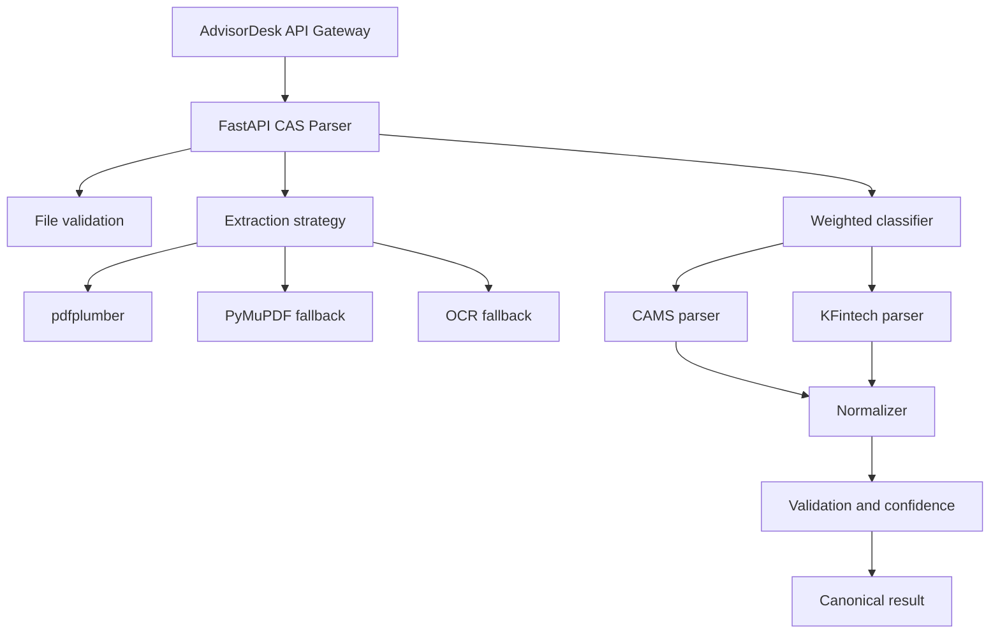

# High-Level Design

## Context
AdvisorDesk sends CAS PDFs to this FastAPI service through an internal API. The service validates files, extracts layout-preserving data, classifies CAMS or KFintech, invokes a provider adapter, normalizes results, validates them, and returns confidence metadata.

The current implementation is a foundation service: it validates uploads, identifies provider signals, and returns partial results while real CAS extraction logic remains fixture-driven.

## Boundaries and security
PDF bytes are accepted only after MIME, signature, and size checks. Temporary files are deleted in `finally`. Raw PDF text, PAN, and financial contents must not be logged. PostgreSQL and queue integrations are deliberately behind interfaces.

Protected PDFs are also accepted through an optional `password` field on the multipart upload request. This field is routed to the extraction strategy so encrypted documents can be attempted with the correct credentials before failing with a structured parse error.

## Failure scenarios
Corrupt, encrypted, oversized, unsupported, low-quality, unknown-provider, and parser-failure cases map to structured errors. Low-confidence extraction is never silently treated as complete.

## Observability
JSON logs carry correlation IDs; metrics should later be attached around extraction, provider detection, validation, duration, and outcomes.

## Enterprise extension
The enterprise version of this service should add async job processing, persistent storage, object storage for files, OCR fallback, provider ML classification, and monitoring. This is documented in [TECHNOLOGY_UPGRADE.md](TECHNOLOGY_UPGRADE.md) and [ENTERPRISE_PROCESSING.md](ENTERPRISE_PROCESSING.md).
