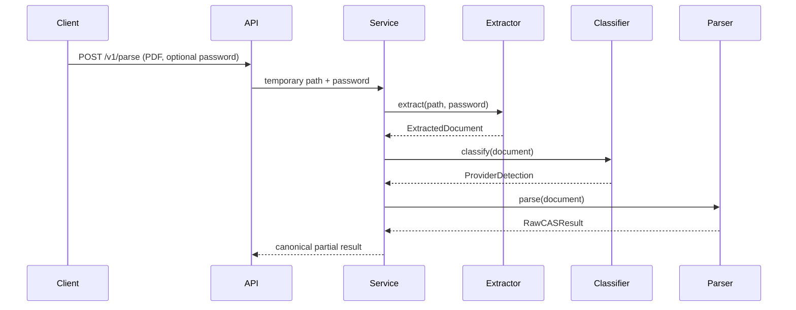

# Low-Level Design

The `app` package separates API, orchestration, extraction, classification, provider parsers, normalization, validation, confidence, and repositories. `DocumentExtractor`, `BaseCASParser`, `ParserRegistry`, `SchemeResolver`, and `ParseRepository` are the principal extension interfaces.

Provider-specific layout code belongs under `app/parsers/cams` or `app/parsers/kfintech`; shared numeric/date/state utilities belong under `shared`. Real fixture-driven state transitions are intentionally pending sample PDFs.

## Password-aware extraction contract
The `DocumentExtractor.extract` interface accepts an optional `password` parameter so encrypted PDFs can be attempted with the supplied credential. The API form field is `password`, and the extraction strategy forwards it to primary, OCR, and fallback extractors when supported.

## OCR and ML extension points
The extraction strategy supports optional OCR fallback, and the classifier layer supports optional ML-based provider detection with a rule-based fallback. This allows the system to improve accuracy without creating a hard dependency on ML packages during standard development.

## Enterprise implementation notes
The long-term production path is to move the parse workflow to async tasks, persistent storage, and monitoring. Those upgrades are described in [TECHNOLOGY_UPGRADE.md](TECHNOLOGY_UPGRADE.md) and [ENTERPRISE_PROCESSING.md](ENTERPRISE_PROCESSING.md).
