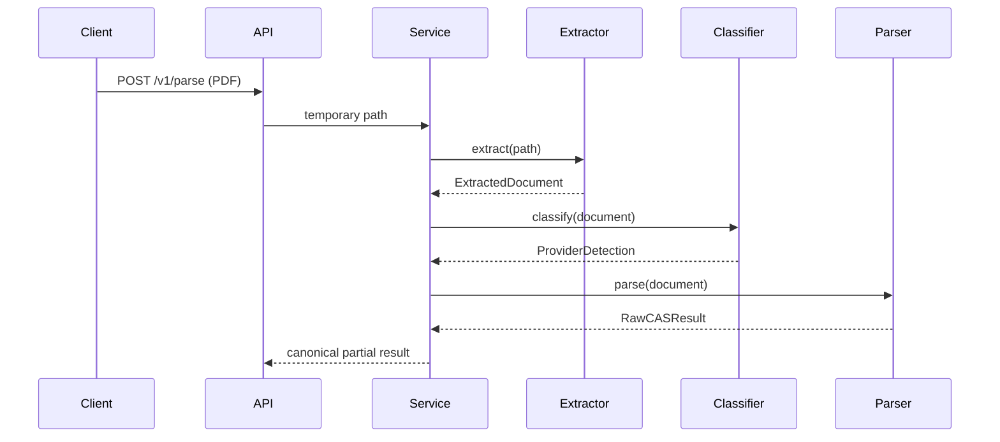

# Low-Level Design

The `app` package separates API, orchestration, extraction, classification, provider parsers, normalization, validation, confidence, and repositories. `DocumentExtractor`, `BaseCASParser`, `ParserRegistry`, `SchemeResolver`, and `ParseRepository` are the principal extension interfaces.

Provider-specific layout code belongs under `app/parsers/cams` or `app/parsers/kfintech`; shared numeric/date/state utilities belong under `shared`. Real fixture-driven state transitions are intentionally pending sample PDFs.
